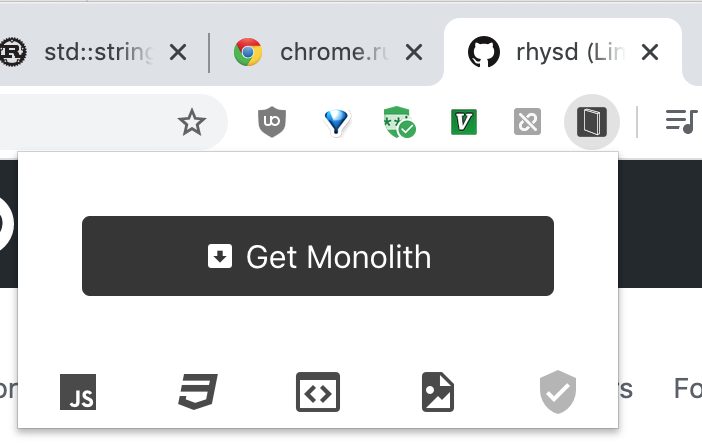

'Monolith of Web': Chrome Extension Port of [Monolith][1]
=========================================================

['Monolith of Web'][6] is a Chrome extension ported from CLI tool [Monolith][1]. Monolith is a CLI tool to
download a web page as static single HTML file. 'Monolith of Web' provides the same functionality as
a browser extension by compiling Monolith (written in Rust) into WebAssembly.

[Video on Youtube][2]

## Installation

- Install from [Chrome Web Store][7]
- Download `.crx` file from [releases page][5] and install it manually

## Usage

1. Go to a web page you want to store
2. Click 'Monolith of Web' icon in a browser bar (above popup window will open)
3. Click 'Get Monolith' button
4. Wait for the process completing
5. The generated single static HTML file is stored in your downloads folder

By toggling icons at bottom of the popup window, you can determine to or not to include followings
in the generated HTML file.

- JavaScript
- CSS
- `<iframe/>`
- Images

## Permissions

- `activeTab`: This extension gets an HTML text and a page title from the active tab to generate a monolith

## Caveats

This extension fetches all resources in [a background page of Chrome extension][9]. The background page
conforms CORS policy. Fetching the resources restricted by CORS policy of the server side may be rejected.
In the case, the resource cannot be embedded in the generated single HTML file hence the resource will
be fallback into empty.

To solve this, there are two ways but both are not acceptable.

1. Add broad permissions `http://*` and `https://*` to the extension manifest. This will require strong
   permissions to users and will be dangerous when the background page has XSS vulnerability. In addition,
   Chrome Web Store spends longer time to review the extension release.
2. Send resource fetching requests via a content script. Since content script is executed in the same CORS
   policy as its site, passing a resource URL to content script and fetching the resource in content script
   would avoid this CORS restriction. However, it makes implementation of this extension more complicated.
   In addition,  CORS request in content script will be [disallowed in manifest V3][10].

## Development

WebAssembly port of Monolith is developed in [the forked repository][4]. Currently it has some differences
and duplicates against the original repository. reqwest did not support Wasm before 0.10.0 so my Wasm
port does not use it and uses `fetch()` directly via `js_sys` and `web_sys` crate.

This repository adds the forked Monolith repository as a Git submodule and uses it by bundling sources
with Webpack.

## Contributing

### Creating an issue

Before reporting an issue, please try the same URL with [CLI version][1]. If it is reproducible with
CLI version, please report it to the CLI repository at first.

If it is not reproducible with CLI version (it means the issue only occurs with this extension), please
report it from [issues page][8].

### Improve Wasm part

This repository only includes TypeScript part of extension. Wasm part is developed in
[forked monolith repository][4]. If your improvement can be applied to [upstream][1], please make a
pull request in the upstream at first. After the pull request is merged, please make an issue to
request to merge upstream at this repository or the forked repository.

## License

Distributed under [the MIT license](LICENSE).

[1]: https://github.com/Y2Z/monolith
[2]: https://www.youtube.com/watch?v=xBIrFlYE1W0
[3]: https://chrome.google.com/webstore/detail/koalogomkahjlabefiglodpnhhkokekg
[4]: https://github.com/rhysd/monolith
[5]: https://github.com/rhysd/monolith-of-web/releases
[6]: https://github.com/rhysd/monolith-of-web
[7]: https://chrome.google.com/webstore/detail/monolith/koalogomkahjlabefiglodpnhhkokekg
[8]: https://github.com/rhysd/monolith-of-web/issues
[9]: https://developer.chrome.com/extensions/background_pages
[10]: https://www.chromium.org/Home/chromium-security/extension-content-script-fetches
